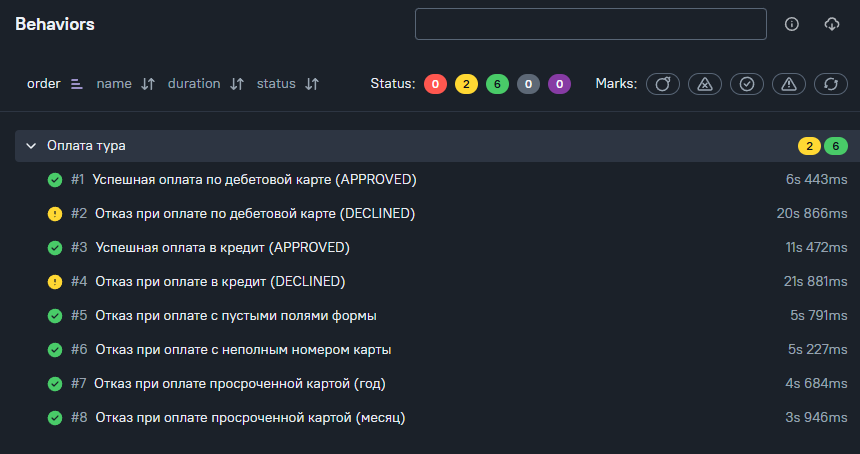
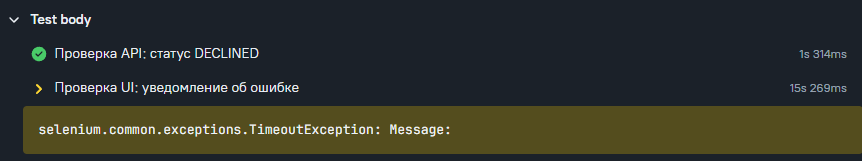

# Отчет по тестированию

## Краткое описание

Проведено автоматизированное тестирование веб-сервиса по продаже туров. 
Протестированы сценарии оплаты по дебетовой карте и в кредит, включая позитивные и негативные кейсы.
Тестирование проводилось с использованием Selenium WebDriver для UI-взаимодействия и прямых API-запросов для проверки статуса платежей.

## Allure-отчёт

## Найденные баги
В ходе тестирования выявлены следующие дефекты:

| № | Краткое описание | Серьёзность | Приоритет | Статус |
|---|------------------|-------------|-----------|--------|
| 1 | В интерфейсе не отображается разница между успешным и неуспешным платежом (всегда одно и то же уведомление) | Minor | Medium | Открыт |

## Рекомендации
1. Исправить отображение уведомлений в UI: показывать разные сообщения для APPROVED и DECLINED
2. Добавить валидацию поля "Владелец"